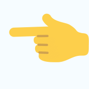

 

# Welcome To My Awesome GitHub Profile 😎

 

 

## A Student of Mechanical Electrical Engineering and a passionate Web and Software Developer 🚀 having an experience of building IoT services, Neural Networks applications, Making Websites and creating Mobile Apps.⭐

 

- 📚 Formation: **Mechanical Engineering | Electrical Engineering | Software Engineering | Full-Stack Web Development**

- 📌 I know about: **IoT | Automation | C++ | Python | Java | Javascript | SQL | NoSQL | Frontend (React & Angular) | Backend (Flask, Springboot & NodeJS) | Cloud (AWS & Google)**

- 📈 I’m looking for: **A work where i can learn new things and where can grow professionally.**

- 💬 I like to talk about: **Science & Technology | Engineering | Code | Music | Soccer | Videogames.**

- ✉️ How to contact me:

  

    
    
      

    

        
Don't forget to visit my second github account where upload small testing projects using different languages.

    

    

        
    

    

        
    

